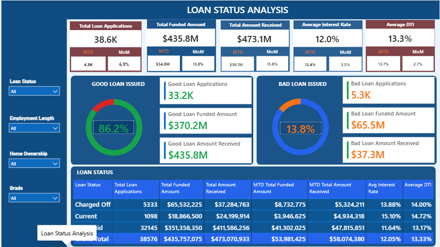

# Bank Loan Analysis Dashboard

## Overview
An interactive Power BI dashboard analyzing 
38,576 bank loan records to uncover insights 
about loan performance, repayment trends 
and risk classification.

## Dashboard Preview
## Summary Dashboard

## Loan Status Analysis Dashboard

## Objectives
- Analyze loan applications, funded and received amounts
- Classify loans into Good vs Bad loans
- Perform trend analysis by month and region
- Identify factors affecting loan repayment
- Build interactive KPI dashboard

## Tools Used
- Power BI Desktop
- Power Query (Data Cleaning)
- DAX (Data Analysis Expressions)

## Dataset
- Records: 38,576 rows
- Columns: 23
- Source: Financial Loan Dataset

## Key KPIs
- Total Loan Applications: 38.6K
- Total Funded Amount: $435.8M
- Total Amount Received: $473.1M
- Average Interest Rate: 12.0%
- Average DTI: 13.3%

## Dashboard Features
- Monthly Loan Trend (Line Chart)
- Loan by Employment Length (Bar Chart)
- Loan by Term (Donut Chart)
- Loan by Grade (Column Chart)
- Loan by Purpose (Bar Chart)
- Loan by Home Ownership (Bar Chart)
- Good vs Bad Loan Analysis
- Interactive Slicers (Purpose, Grade)

## Business Questions Answered
1. What is the total number of loan applications?
2. What percentage of loans are Good vs Bad?
3. Which months have highest loan applications?
4. Which states have highest loan demand?
5. Which loan grade has highest applications?
6. What is the most common loan purpose?

## Key Insights
- Grade B has highest loan applications (11.7K)
- Debt consolidation is top loan purpose (18K)
- 10+ years employment has most applications (8.9K)
- Rent dominates home ownership category
- Loan applications grow consistently month over month

## Business Recommendations
- Focus on Grade A & B borrowers for approval
- Expand loan offerings in top performing states
- Create special debt consolidation packages
- Monitor Charged Off loans immediately
- Review high DTI borrowers carefully

## Related Projects
- [Bank Loan Analysis SQL Project](link to SQL repo)

